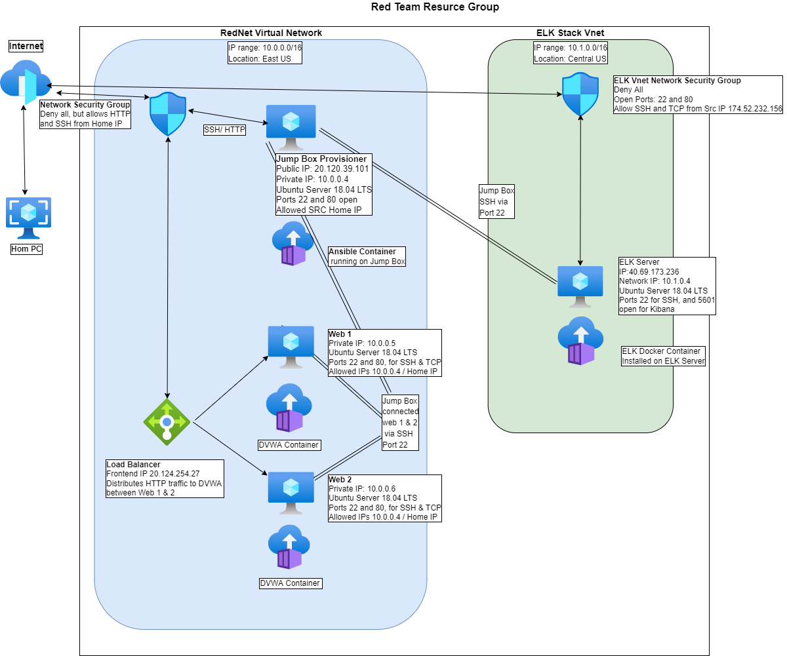

## Automated ELK Stack Deployment

The files in this repository were used to configure the network depicted below.

These files have been tested and used to generate a live ELK deployment on Azure. They can be used to either recreate the entire deployment pictured above. Alternatively, select portions of the playbook file may be used to install only certain pieces of it, such as Filebeat.

This document contains the following details:
- Description of the Topologu
- Access Policies
- ELK Configuration
  - Beats in Use
  - Machines Being Monitored
- How to Use the Ansible Build

### Description of the Topology

The main purpose of this network is to expose a load-balanced and monitored instance of DVWA, the D*mn Vulnerable Web Application.

Load balancing ensures that the application will be highly responsive, in addition to restricting traffic to the network.
Load Balancers also sever an inmportant security role when it comes to defending against DDoS attacks.

A Jump allows a system administrator to access all computers on the network, from one secure node.

Integrating an ELK server allows users to easily monitor the vulnerable VMs for changes to the data and system logs.
- Filebeat collects log across multiple servers, and forwards them to Elestic search, or Logstash
- Metricbeat collects and centralizes metric data, and forwards it to Elastic Serarch.

The configuration details of each machine may be found below.

| Name      | Function    | IP Address | Operating System        |
|-----------|-------------|------------|-------------------------|
| Jump Box  | Gateway     | 10.0.0.5   | Ubuntu Server 18.04 LTS |
| Web 1     | Webserver   | 10.0.0.5   | Ubuntu Server 18.04 LTS |
| Web 2     | Webserver   | 10.0.0.6   | Ubuntu Server 18.04 LTS |
| ELK VM    | ELK Stack   | 10.1.0.4   | Ubuntu Server 18.04 LTS |

### Access Policies

The machines on the internal network are not exposed to the public Internet. 

Only the Jump-Box machine can accept connections from the Internet. Access to this machine is only allowed from the following IP addresses:
- 174.52.232.156

Machines within the network can only be accessed by Jump-Box Provisioner: 10.0.0.4

A summary of the access policies in place can be found in the table below.

| Name       | Publicly Accessible | Allowed IP Addresses |
|------------|---------------------|----------------------|
| Jump Box   | Yes                 | (Home Public IP)     |
| Web 1      | No                  | 10.0.0.4             |
| Web 2      | No                  | 10.0.0.4             |
| ELK Server | No                  | (Home Public IP)     |

### Elk Configuration

Ansible was used to automate configuration of the ELK machine. No configuration was performed manually, which is advantageous because
you are able to send commands to multiple servers at once, through a single playbook.

The playbook implements the following tasks:
- Install: docker.io_
- Install: python-pip
- Commmand: Sysctl -w vm.max_map_count=262144
- Lauch docker contianer: elk

The following screenshot displays the result of running `docker ps` after successfully configuring the ELK instance.

### Target Machines & Beats
This ELK server is configured to monitor the following machines:
- Web 1: 10.0.0.4
- Web 2: 10.0.0.5

We have installed the following Beats on these machines:
- Filebeat
- Metricbeat

These Beats allow us to collect the following information from each machine:
- Filebeat

### Using the Playbook
In order to use the playbook, you will need to have an Ansible control node already configured. Assuming you have such a control node provisioned: 

SSH into the control node and follow the steps below:
- Copy the **/etc/ansible/file/filebeat-configuration.yml** file to .
- Make the following cahnges to the */etc/ansible/hosts* file.
 

- Run the playbook, and navigate to *[ELK-VM IP]:5601\app\kibana\* to check that the installation worked as expected.
